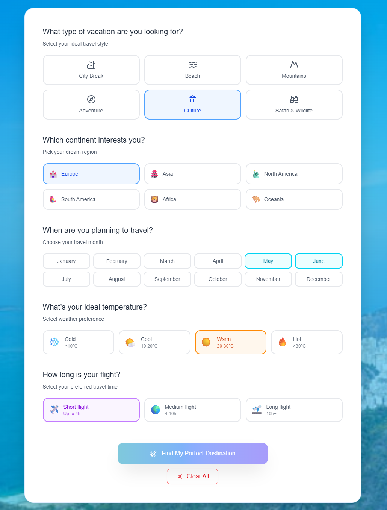
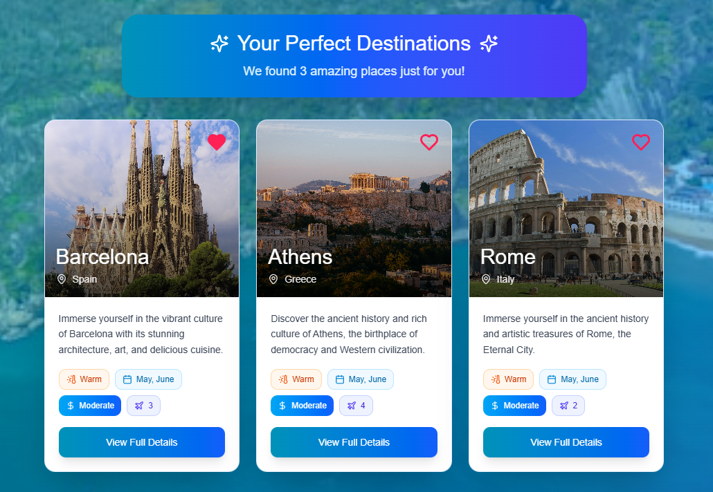
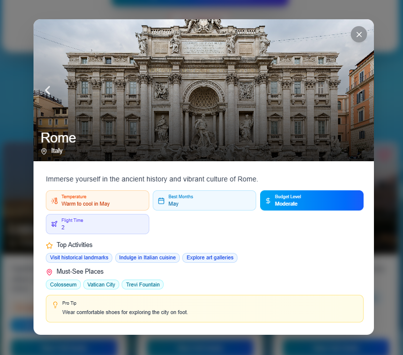
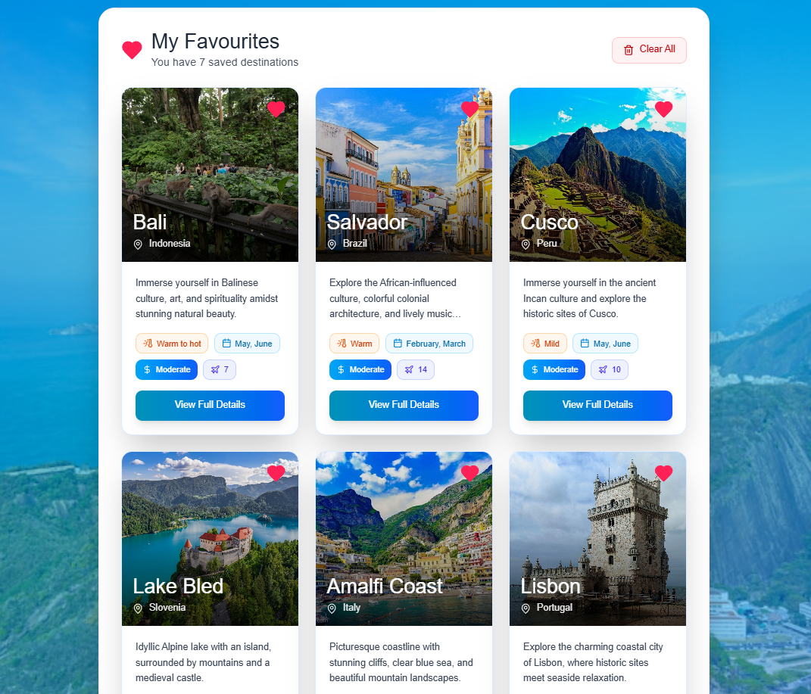

# Travel Planner

Travel Planner is a modern, AI-powered web application that helps you discover your next dream holiday destination. Built with Next.js and TypeScript, it leverages OpenAI to generate personalized travel recommendations based on your preferences. The app fetches real images for each destination and allows you to save your favorites for future inspiration.

## Features

- **Multi-step Search Form:** The homepage features a clear, interactive form that guides you through selecting your travel preferences. You can choose:
	- Vacation type (e.g., city break, beach, mountains, adventure, culture, safari)
	- Continent
	- Best months for travel
	- Desired temperature range
	- Flight duration

- **AI-Powered Recommendations:** After submitting your preferences, the app uses OpenAI to generate up to three tailored travel destinations that best match your criteria.

- **Live Destination Images:** For each recommended destination, the app fetches real images using the Google Custom Search API, making the experience visually engaging.

- **Destination Details Modal:** Click on any destination to view a detailed modal with a description, highlights, travel tips, best months, activities, and a large image.

- **Favorites System:** You can save and manage your favorite destinations. The favorites are stored locally in your browser and accessible from the dedicated Favorites page.

- **Responsive, Modern UI:** The interface is built with React and Tailwind CSS, ensuring a smooth experience on both desktop and mobile devices.

- **Error Handling & User Guidance:** If no destinations are found, the app provides helpful tips to adjust your preferences and try again.

## How It Works

1. **Fill Out the Form:** On the homepage, answer a few questions about your travel preferences.
2. **Get AI Recommendations:** The app sends your preferences to an API route, which queries OpenAI for the best matching destinations.
3. **Browse Results:** View up to three recommended destinations, each with a real photo and key information.
4. **View Details:** Click on a destination to see more details in a modal window.
5. **Save Favorites:** Mark destinations as favorites to save them for later. Access all your favorites from the Favorites page.

## Screenshots

**Header**  
Start your travel planning journey with an inviting homepage and easy navigation.


**Travel Planner Form**  
Select your vacation type, preferred temperature, continent, and other preferences in a clear, interactive form.




**Three AI-recommended destinations**  
The app presents three travel destinations found by the AI, each with a summary and image. Click any card to see more details about the place.




**Destination details view**  
Explore all details of a selected destination: images, description, highlights, travel tips, and more.




**Favorites view**  
Easily access and manage your saved favorite destinations.




## Getting Started

1. **Clone the repository:**

	```bash
	git clone https://github.com/Kasiaqu/travel-planner.git
	cd travel-planner
	```

2. **Install dependencies:**

	```bash
	npm install
	```

3. **Set up environment variables:**
		- Create a `.env.local` file in the root directory.
		- Add your OpenAI and Google Custom Search API keys:

	```env
	OPENAI_API_KEY=your-openai-key

	GOOGLE_API_KEY=your-google-api-key

	GOOGLE_CSE_ID=your-google-cse-id
	```

4. **Run the development server:**
	```bash
	npm run dev
	```

5. **Open [http://localhost:3000](http://localhost:3000) in your browser.**

## Technologies Used

- [Next.js](https://nextjs.org/) (App Router)
- [React](https://react.dev/)
- [TypeScript](https://www.typescriptlang.org/)
- [Tailwind CSS](https://tailwindcss.com/)
- [OpenAI API](https://platform.openai.com/docs/api-reference)
- [Google Custom Search API](https://developers.google.com/custom-search/v1/overview)
